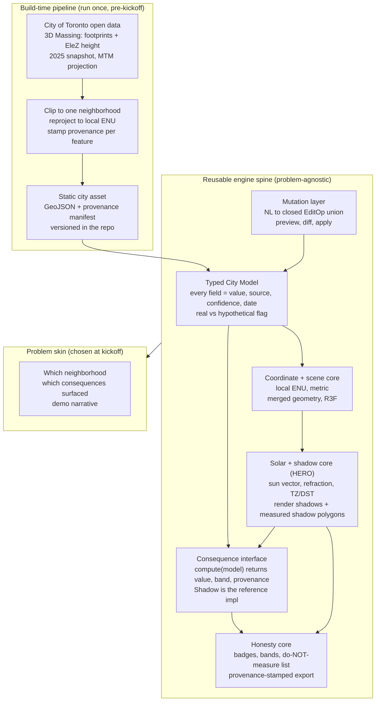

# Massing, v1 Architecture Reference

Status: hackathon engine spine. Scope is one Toronto neighborhood, shadow done right, honesty layer present, stop. This doc is the shared state. Decisions marked `[OPEN]` need your call and become ADRs in `docs/decisions.md`. Everything in section 1 is treated as settled and is not relitigated.

---

## 0. Purpose and reading guide

This describes the four parts of v1 as a reusable engine plus a thin problem skin, so the spine is built before the June 8 kickoff and pointed at whatever housing or resilience problem the challenge poses. The engine knows nothing about the specific problem. The skin (which neighborhood, which consequences are surfaced, the demo narrative) is chosen at kickoff.

Read sections 2 and 5 first. Section 2 is the shape. Section 5 is the hero and the place most of the risk lives. Section 10 is the consolidated list of calls I need from you. Section 11 is the three places I think you are underestimating difficulty.

---

## 1. What is settled (not relitigated)

These come from your hard rules and the research. I treat them as fixed.

- Toronto, real City of Toronto open-data heights, measured not guessed.
- Next.js 15 App Router, TypeScript, deploy on Vercel, pnpm.
- React Three Fiber / Three.js as the 3D substrate (real-time moving shadows is the requirement that rules out deck.gl and Cesium).
- Local ENU tangent plane anchored at the neighborhood centroid, metric units. Not Web Mercator.
- Merged-geometry buildings, single `DirectionalLight` with `PCFSoftShadowMap`, `shadowMap.autoUpdate = false` with explicit `needsUpdate = true` on sun move.
- Typed structured city model where every load-bearing field carries `(value, source, confidence, date)`.
- LLM mutation as a closed `EditOp` union with bounded numerics and existing-entity-ID references, structured-output / strict mode, a pre-resolved scene-description context block, preview-before-apply with a diff. The model never computes geometry.
- Ship only consequences whose confidence is honestly computable (geometry-derived). Behavioral consequences go in the do-NOT-measure list. Traffic may appear only as a factual readout of existing open-data counts, never as a prediction.
- Confidence bands, never single numbers. Provenance baked into the exported artifact, not just the surrounding UI.

The one locked item I am pushing back on is SunCalc as the live solar engine. That is a real problem, written up in section 5 and flagged in section 10. Per your rule I am surfacing it rather than quietly overriding it.

---

## 2. System shape: engine spine vs problem skin



The seam that buys flexibility is the consequence interface (section 8). The typed city model is consequence-agnostic. Each geometry-derived consequence is a plugin implementing one interface. At kickoff you add or emphasize whichever geometry-derived consequence fits the posed problem without touching the data, coordinate, solar, or mutation layers. That is the loaded weapon: the trigger is the consequence plugin, the gun is already built.

---

## 3. Part 1: data ingestion and the typed city model

### The data, concretely

Source is City of Toronto open data, 3D Massing. Footprints plus per-building height in the `EleZ` attribute, LiDAR/photogrammetry-derived, native projection MTM (the "3D Massing (MTM3)" file), metric units. This is the right source: heights are measured, the projection is already metric with low distortion over a single city, and it is recognizable Toronto.

Two facts change the plan:

1. The portal entry is now marked Retired (verified late 2025). Real 2025-vintage data was published from it and is mirrored by third parties (School of Cities PMTiles by Jeff Allen, mapTO's GTHA buildings), so the data is obtainable, but you cannot assume a live, refreshing endpoint. Bake a snapshot now and version it.
2. Confirm what `EleZ` means before trusting it. The name suggests an elevation (Z above a datum), not necessarily height above the building's own ground. If it is absolute elevation you must subtract ground elevation to get the extrusion height, otherwise every building floats or sinks. This interacts with the terrain decision in section 4. Resolve this in your verification afternoon: pick three buildings of known real height and check whether `EleZ` equals their height or their roof elevation.

### Pipeline: bake, do not fetch (recommended, near-settled by constraints)

Clip the citywide data to one neighborhood, reproject from MTM to local ENU, stamp each feature with dataset-level provenance, and emit a static asset (GeoJSON for footprints plus a small provenance manifest) committed to the repo. Reasons: the source is retired so a snapshot is the only reproducible option, the demo must work offline on hotel wifi, load is instant, and the provenance is frozen and auditable. The alternative (runtime fetch and reproject in the browser) buys nothing here and adds a live dependency on a retired dataset. I am treating bake-a-snapshot as the recommendation, not an open decision, unless you object.

### The typed model

Provenance is a wrapper on every load-bearing field. Most provenance here is dataset-level and rule-derived, not per-feature from the city: the city does not ship per-building uncertainty, so "measured vs estimated" is a category you assign, and the sigma you attach to each category is a judgment you must source (see section 11, flag B).

```typescript
type Provenance<T> = {
  value: T;
  source: string;   // "Toronto Open Data, 3D Massing"
  date: string;     // ISO; vintage of the source, not the fetch time
  confidence: Confidence;
};

type Confidence =
  | { kind: "measured"; sigma_m: number }     // LiDAR-derived height, sigma in metres
  | { kind: "estimated"; sigma_m: number }    // derived or assumed, wider sigma
  | { kind: "hypothetical" };                 // user-injected, no real-world referent

type Building = {
  id: string;
  footprint: number[][];             // local ENU metres, outer ring then holes
  height: Provenance<number>;        // metres above its own base
  baseElevation: Provenance<number>; // metres; flat-ground v1 may pin to 0 and disclose
  origin: "toronto-open-data" | "user-edit";
};

type CityModel = {
  originLatLon: [number, number];    // ENU anchor
  crsNote: string;                   // "local ENU, metres, origin at <lat,lon>"
  buildings: Building[];
  sources: SourceManifest;           // dataset-level provenance for the export footer
};
```

The `origin` field is load-bearing for honesty: a user-added tower is `hypothetical` and must badge differently from real data everywhere, including the export footer ("this view contains 1 hypothetical structure you added").

`[OPEN]` decisions in this part: neighborhood choice (section 10, decision 1).

---

## 4. Part 2: coordinates, scene, and the receiver problem

ENU anchored at the centroid, metric, is settled and is now cheap because the source is already metric MTM: recenter and you are done, the distortion argument is satisfied without a heavy transform. Sun directions are unit vectors in this frame.

Merged geometry, single directional light, PCF soft shadows, manual `needsUpdate` on sun move is settled (section 1). Buildings are both shadow casters and receivers (self-shadowing and shadows on neighbors are the point).

The open question is what the ground is. Shadows have to fall on something, and Toronto is not perfectly flat.

`[OPEN]` decision, terrain and base elevation (section 10, decision 2). Three options:

- Flat ground plane at Z=0, buildings extruded from 0. Simplest. Wrong where the neighborhood slopes, and wrong if `EleZ` is an absolute elevation. Defensible only if the chosen neighborhood is near-flat, and only if flat-ground is disclosed in the do-NOT-measure list.
- Per-building base elevation from data, buildings sit at correct Z, ground still a flat plane. Partial: building-to-building shadows improve, ground-shadow on slopes still wrong.
- Full terrain mesh from a DEM. Correct, but pulls in another dataset and more work.

My lean: flat ground for v1 and let the honesty layer absorb the simplification by naming "terrain and ground slope" in the do-NOT-measure list. This is on-brand rather than embarrassing: the tool that says what it does not model is allowed to not model terrain as long as it says so, and a flat plane is fine on a flat downtown site. This decision is downstream of the neighborhood choice and the `EleZ` semantics check, so make those first.

---

## 5. Part 3: solar and shadow core (the hero)

This is the subsystem that has to be bulletproof. It has five concerns.

### Sun vector engine

`[FLAG, real problem with a locked choice]` You locked SunCalc for the live slider and a separate validated SPA implementation for batch and validation. The problem is that this ships two different solar engines, so the shadows the judge watches sweep in real time are computed by a different, less accurate algorithm than the shadows you validated. SunCalc does not model atmospheric refraction and uses simplified position formulas. When a judge asks "how do you know your shadows are right" and the honest answer is "the ones we validated are not the ones on screen," the honesty brand takes the hit.

Option I want you to consider: use `astronomy-engine` (Don Cross) for both the live path and validation. It is high accuracy, has an explicit refraction option, and is fast enough for an interactive slider. That collapses two engines into one, removes the live-versus-validated discrepancy, and gives you refraction for free on the live path. Keep NREL SPA only as an external oracle you check against, not as a second runtime engine. This is the decision in section 10, decision 3. If you have a reason to keep SunCalc (bundle size, familiarity), say so and I will design around the discrepancy by labeling the live view as indicative and the export as validated.

### Time, the most common shipped bug

Pin all time math to the `America/Toronto` IANA zone regardless of the client's locale, and represent the scrub position as a zoned instant, never a naive `Date`. The challenge window (June 8 to 19) is EDT, UTC-4.

Why naive noon is visibly wrong, so we get it right on purpose: the shadow at 12:00 clock time does not point due north in Toronto. Toronto sits near 79.4 W, while EDT is referenced to 60 W, so the sun reaches the meridian roughly an hour-plus after clock noon, shifted further by the equation of time. A correct engine handles this if you feed it the right instant and longitude. The bug is never in the astronomy, it is in constructing the instant: using the browser's timezone instead of Toronto's, or building a `Date` from a local string. Use Temporal or a zoned date library, construct the instant explicitly in `America/Toronto`, and DST is handled.

### Low sun angles, refraction, and false precision

Shadow length is `h / tan(altitude)`. Its sensitivity to altitude error is `h / sin^2(altitude)`, which blows up near the horizon. At 10 degrees altitude a half-degree error in the sun's altitude moves a 100 m building's shadow by roughly 30 m. Low sun is exactly the regime people fight about (early morning and late afternoon shadows on parks and homes) and exactly where any solar-position error and atmospheric refraction matter most. Two consequences:

- Model refraction (another reason to prefer astronomy-engine on the live path).
- Below a low-altitude threshold, stop quoting a precise shadow length. Either widen the band enormously or switch to a qualitative "long shadow" state. This is the "refuse false precision" rule made literal in the one place it bites hardest.

### Two-track shadows: rendered versus measured

This is the subtle architectural point (section 11, flag C). Render-based PCF shadows are great for the live pretty sweep but are not a trustworthy measurement: at city scale a single shadow camera over hundreds of metres plus near-horizontal light at low sun gives you acne, peter-panning, and resolution-limited edges. If the rendered shadow visibly disagrees with the number you print, the honesty tool is dead.

So the source of truth for any measured claim is not the shadow map. It is a geometric shadow-polygon computation: project each footprint along the sun vector onto the ground plane (and clip against receivers), which is exactly what a planning shadow study does, and is exact given the geometry. Architecture:

- Rendered PCF shadows drive the live, interactive, beautiful sweep.
- Geometric shadow polygons drive any measured number, the confidence band, and the export.
- The UI reconciles them: what you see is the render, what we measured is the polygon, and they are kept close enough that the difference never reads as a contradiction on screen.

### Confidence band methodology

The band must be a defined, defensible computation, not a vibe. Scope it to height-only uncertainty for v1 and declare that scope (footprint and position error excluded, stated in the do-NOT-measure list). Method: per timestep, take each building's height distribution from its `Confidence.sigma_m`, and either Monte Carlo sample to get a shadow envelope or propagate analytically through `h / tan(altitude)`. The band represents the spread of measured-shadow extent given height uncertainty at that sun position, which means the band is naturally wider at low sun. Storey-to-metre conversion for user-added buildings (roughly 3 to 3.5 m residential, more for commercial) is itself an estimate and feeds the band as additional sigma, badged estimated.

### Validation

`[Reframed, see section 11, flag A]` Validate the solar engine, not a consultant's PDF. Check the sun vector against NREL SPA or NOAA tables for Toronto across a year of dates and times: this is rigorous, fast, and gives the bulletproof answer. Add an analytic geometry check: a vertical stick of height h at altitude a casts exactly `h / tan(a)`, verify the polygon engine reproduces it to the millimetre. Treat "polygon-for-polygon against a published Toronto study" as a stretch overlay for the pitch, not a gating requirement, for the reasons in flag A.

`[OPEN]` decisions in this part: solar engine (decision 3).

---

## 6. Part 4: natural-language mutation layer

The structured-output part is easy. The hard part is grounding references to real entities, which is why the model gets entity IDs and never computes geometry.

```typescript
type EditOp =
  | { op: "AddBuilding"; at: [number, number]; heightStoreys: number; use?: BuildingUse }
  | { op: "ModifyBuilding"; id: string; heightStoreys?: number; use?: BuildingUse }
  | { op: "RemoveBuilding"; id: string };
// Bounded numerics enforced at parse time (e.g. 1..120 storeys).
// id must reference an existing building. "at" comes from a user click in v1,
// not from free-text spatial reasoning.
```

Flow: pre-resolve a scene-description context block (a compact list of nearby entity IDs, their use, approximate size, and the clicked location) and hand it to the model alongside the user text. The model emits an `EditOp` against that context. Parse and validate (bounded numerics, ID existence). Render a preview as ghost geometry with its shadow. Show a diff. Apply commits to the model with `origin: "user-edit"` and `confidence: hypothetical`.

`[OPEN]` decision, the placement model (section 10, decision 4). "Add a 30-storey tower on this lot" has two parts: the what (30 storeys, tower, residential) and the where ("this lot"). Free-text resolution of "this lot," "the corner," "next to the school" is a rabbit hole, and lots are not even in the footprint data (parcels are a separate dataset). My lean: click-to-place sets the where, NL sets the what. The user clicks a location, then types the change. This is robust, demo-friendly, and sidesteps both spatial reasoning and the parcel dependency. Pure-text placement is a post-hackathon problem.

The honesty hook here is non-negotiable: a user-added building is hypothetical everywhere, badged distinctly, counted in the export footer. The mutation log also gives you undo and a clean separation between real Toronto and the user's what-if.

---

## 7. The honesty layer (cross-cutting)

This threads through every part above and is the differentiator, so it is not a UI afterthought.

- Per-building data-quality badges: measured vs estimated vs hypothetical, driven by `Confidence.kind`.
- Per-consequence confidence bands tied to input quality, computed as in section 5, never a single number.
- A visible do-NOT-measure list, treated as a feature. It names what the tool refuses to fake: traffic change, displacement, property values, human movement, plus the v1 engineering simplifications you chose to disclose (terrain and ground slope if you take the flat-ground option, footprint and position error, anything else cut). Naming the refusals is the strongest proof of honesty and the thing that survives a hostile judge.
- Provenance-stamped export. The footer is baked into the image artifact, not drawn in surrounding UI, so it survives a screenshot pasted into a council slide. Footer carries data sources and dates, the height-confidence breakdown for what is shown, the count of hypothetical structures, and the do-NOT-measure summary.
- Traffic, if shown at all, is a factual readout of existing Toronto open-data counts with source and date, never a prediction of the change. No confidence score rescues a behavioral prediction.

---

## 8. The consequence interface (the problem-flexibility seam)

Every geometry-derived consequence implements one interface and returns a band plus provenance, never a bare number. Shadow is the reference implementation. This is what lets you point the spine at the kickoff problem.

```typescript
type Band = { low: number; mid: number; high: number; unit: string };

type ConsequenceResult = {
  id: string;                 // "shadow" | "far" | "walkability" | ...
  band: Band;
  provenance: string[];       // which inputs and their confidence drove the band
  notModeledNote?: string;    // honesty hook
};

interface Consequence {
  id: string;
  compute(model: CityModel, ctx: ComputeContext): ConsequenceResult;
}
```

Honest cost accounting for the candidate second consequence, because "cheap" is not uniform:

- Density / FAR is the only truly cheap one, and even it needs a site area. Avoid the parcel dataset by using the clicked or drawn lot as the site, or report gross added floor area, and disclose the choice. Floor area from footprint area times storeys, band from height and storey-conversion uncertainty.
- Sky view factor is medium: hemispherical raycasting from a point against surrounding geometry. Geometry-derived and honest, but not free.
- Walkability by network distance is not cheap: it needs a street-network graph (Toronto Centreline or OSM) and a routing engine. Treat it as a stretch, not a freebie.

`[OPEN]` decision, whether and which second consequence ships (section 10, decision 5). My lean: FAR if any, and only after the shadow path is demo-solid.

---

## 9. Hard rules mapped to where they are enforced

| Hard rule | Enforced in |
| --- | --- |
| Real measured Toronto heights | Part 1, baked snapshot, `EleZ` after semantics check |
| Shadow correct, validated solar | Part 3, single solar engine, SPA oracle, analytic geometry check |
| Correct TZ/DST | Part 3, zoned instants in America/Toronto |
| Refuse false precision | Part 3, low-angle policy, band not number |
| Only honestly-confident consequences | Part 8 interface, behavioral ones excluded by construction |
| Traffic as readout only | Part 7, factual counts, never prediction |
| Survive a screenshot | Part 7, provenance baked into the artifact |
| Confidence bands not numbers | Parts 5, 7, 8, `Band` is the return type |

---

## 10. Open decisions awaiting your call

1. Neighborhood. Criteria: recognizable to Waterloo-region judges, a notable public park or open space adjacent to tall or mid-rise buildings for the "shadow falls on a real park" money shot, real measured heights, near-flat if you take the flat-ground option, and a building count the renderer is comfortable with. Candidate directions: the St. Lawrence / St. James Park area (recognizable, real towers, a real park, dramatic shadows), Downtown Yonge around Sankofa Square (very recognizable, dense), or a tower cluster like North York Centre or Yonge-Eglinton. My lean is a downtown site with a clear park next to towers. Your call.
2. Terrain and base elevation (section 4). Flat plane vs per-building base elevation vs DEM. My lean: flat plane, disclosed in the do-NOT-measure list, contingent on a flat neighborhood and the `EleZ` check.
3. Solar engine (section 5). Keep SunCalc plus separate SPA as locked, or consolidate on astronomy-engine for both with SPA as an external oracle. My lean: consolidate.
4. Placement model (section 6). Click-to-place for the where plus NL for the what, vs free-text placement. My lean: click plus NL.
5. Second consequence (section 8). None for v1, FAR, or something else. My lean: FAR, only after shadow is solid.

Minor, not blocking: the mutation model should be one with strict structured output or forced tool use, and the `EditOp` schema is provider-agnostic.

---

## 11. The three places difficulty is underestimated

Flag A, validating shadows against a published Toronto study is a mini research project, not a checkbox. Published planning shadow studies use standardized conventions (equinox test dates, fixed time windows and steps, often no refraction, sometimes a different solar algorithm), they use the developer's proprietary 3D model rather than open data, and they publish raster figures in PDFs, not machine-readable shadow polygons. To match polygon-for-polygon you would have to find a study that publishes enough detail, rebuild its exact scene from open data that may differ from their model, and replicate its exact solar conventions. That is days of work with a real chance of no clean match. The rigorous and achievable answer is to validate the solar engine against NREL SPA or NOAA tables and the polygon engine against the analytic `h / tan(altitude)` identity, and treat any study overlay as a qualitative pitch aid. Reframe the validation plan now so you are not chasing a consultant PDF in demo week.

Flag B, the confidence band is itself a modeling commitment, and the input uncertainty it rests on is mostly not in the data. The honesty brand depends on the band being real, but the city does not ship per-building height uncertainty. "Measured vs estimated" is a category you assign, and the sigma you attach to each category is a judgment you must source and defend (LiDAR vertical accuracy figures, for instance). Then the band is a nonlinear propagation of that sigma through `h / tan(altitude)`, sun-angle-dependent and time-varying. If you hand-wave either the input sigma or the propagation, you have reintroduced the exact false rigor you are trying to avoid, one level up. Write the uncertainty model down explicitly, cite its inputs, keep its scope narrow (height-only for v1), and state the scope. The band's credibility is the whole product.

Flag C, rendered shadows and measured shadows are two different things, and you are confident on the rendering side. Your R3F experience means the PCF shadow map will look good, which is the trap. At city scale with near-horizontal light at low sun, the shadow map gives acne, peter-panning, and resolution-limited edges, and if the rendered shadow visibly disagrees with the number you print, the honesty tool dies on stage. The architecture in section 5 keeps two tracks: rendered PCF for the live sweep, geometric shadow polygons as the source of truth for every measured claim and the export. Budget time for reconciling them so the seam never reads as a contradiction. This is the one most likely to bite precisely because the rendering feels solved.

---

## 12. Scope: what v1 does NOT do

Engineering cuts: one neighborhood only, no neighborhood switching. No parcel dataset (lots come from clicks). No street network or routing unless walkability is explicitly chosen. No free-text spatial placement. Likely no terrain mesh (flat plane, disclosed). No interior floors, no setbacks, no architectural detail beyond extruded footprints. No accounts, no persistence beyond the session, no multi-user.

Honest refusals, the do-NOT-measure list: traffic change, displacement, property-value change, human movement and any behavioral simulation. Plus the disclosed v1 simplifications: ground slope and terrain, footprint and position error, storey-to-metre assumptions for user-added buildings.

The failure mode is a sprawling half-built thing. The five-second moment (type a change, watch the shadow fall on a real Toronto park, see the honest badges) is the entire project. Everything not serving that moment is cut.

---

## 13. Pre-kickoff vs at-kickoff

Build before June 8: the full engine spine. Baked neighborhood snapshot with provenance, typed city model, ENU coordinate and scene core, solar and shadow core with both tracks and the validation harness, the mutation layer with click-plus-NL and preview-diff-apply, the honesty core with badges, bands, the do-NOT-measure list, and provenance-stamped export, and the shadow reference implementation of the consequence interface.

Decide at kickoff: which neighborhood best fits the posed problem, which consequence plugins to surface or add, and the demo narrative. Because the consequence interface is the only thing that changes, you arrive with a loaded weapon and aim it once the target appears.
